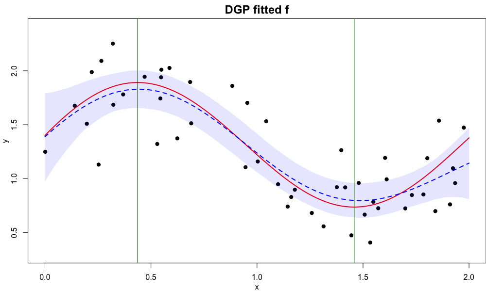
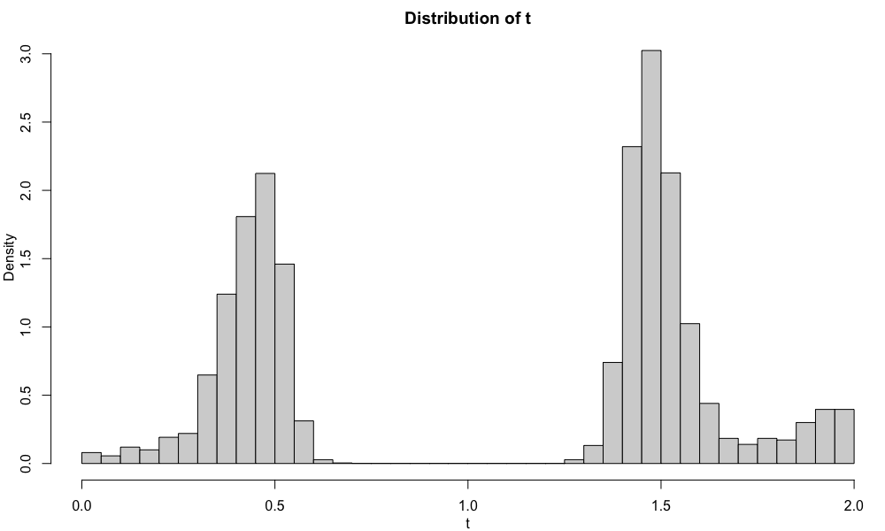
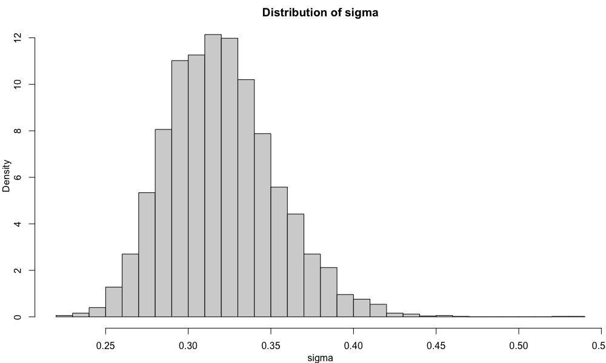

# DGP-MCEM

This repository contains relevant R code for implementing the Monte Carlo Expectation Maximization (MCEM) algorithm of the Derivative Gaussian Processes model. In addition to estimating a nonparametric regression function, the model and the algorithm (DGP-MCEM) infer the locations of stationary points of the function by providing the full posterior distribution of the stationary points. The approach has been applied to the estimation of event-related potentials (ERP) derived
from electroencephalography (EEG) signals. For more details about DGP-MCEM model and algorithm, please read the paper [Yu et al. (2020). Bayesian Inference for Stationary Points in Gaussian Process Regression Models for Event-Related Potentials Analysis](https://arxiv.org/abs/2009.07745)

## Demo and Usage

### Required packages and R version
The required R packages include **Matrix**, **matrixcalc**, **Rsolnp**, **emulator**, **R.utils**. The package **parallel** and **doParallel** are used for simple multi-core computing. The latest R version is recommended, but any version >= 3.6 should work.

### Simulated Data and ERP data
All 100 simulated data sets for analysis in the paper are stored in `./data/sim_data.Rdata`. The simulated data are generated using the script `creat_sim_data.R` in the folder ./data-raw. The ERP data are stored in the 4 Rdata formatin the folder ./data: `subj_y.RData`, `y_bias.RData`, `subj_y_old.RData`, `y_bias_old_11_bias_only.RData`.

### Starts with a demo
The R script `demo.R` provide an example to illustrate how the algorithm is implemented with a simulated data set. The data set is the first simulated data set stored in `./data/sim_data.Rdata`. The main functions of MCEM are in the script `mcem_fcns.R` in the ./R folder. In particular, `mcem_dgp()` function implements MCEM with single-DGP and `mcem_dgp_multi()` function implements MCEM with multiple-DGP. The functions return a list including samples of stationary points `sample_t`, samples of $\sigma$, `sample_sig` and the values of hyperparameters in the covariance function of every iteration, saved as `thetas`.

### Full simulation study
The entire simulation study in the reference paper can be reproduced by running the script `simulation_main_mcem.R`, including comparing single-DGP, multiple-GDP and ordinary Gaussian process regression (GPR). 

The simulation results are stored in `sim_result_algo.RData` for running algorithms, and `sim_pred_gp_lst.RData`, `sim_pred_dgp_oracle_lst.RData`, `sim_pred_dgp_single_lst.RData`, `sim_pred_dgp_multiple_lst.RData` for information about samples of $f$. To save time running, one can load these data for further analysis. A matern kernel analog of simulation study is performed in `simulation_main_matern_mcem.R`.

### Full Data Analysis
The full ERP data analysis is performed in `data_analysis_subject_sig_mcem.R`. The script `data_analysis_subject_sig_mcem.R` performs the multiple-DGP analog of analysis.

### Figures in the paper
To reproduce every figure shown in the paper, run the script `figures_paper_mcem.R`.

### Supplementary materials
Analysis in the supplementary materials can be found in other R scripts that are not mentioned.

## Basic Results from `demo.R`

The data and fitted result is shown in the image below. 

The red curve is the true regression function, and blue dash curve is the posterior mean curve after drawing 100 sample paths of $f$. The light blue shaded area indicates 95% credible band for $f$. Two green vertical lines indicate the location of stationary points.

The distributions of $t$ and $\sigma$ are generated directly from the Monte Carlo step in the MCEM algorithm. These distributions are obtained without the need of sampling paths of $f$.

